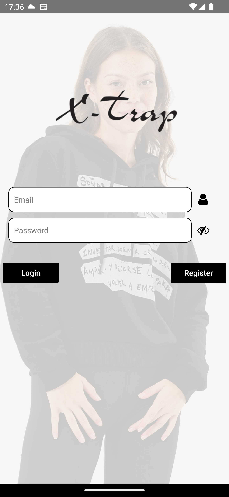
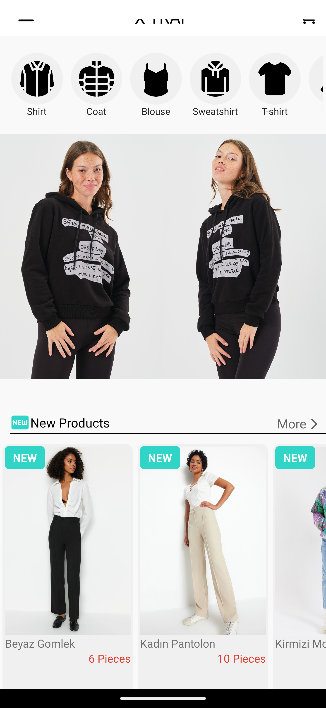
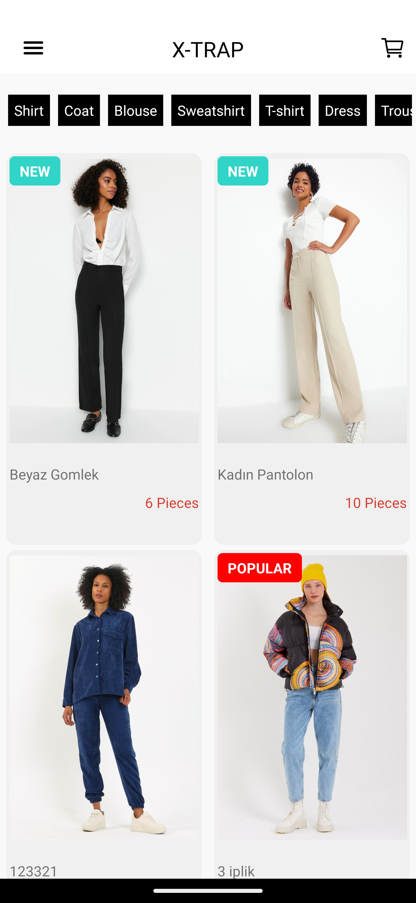
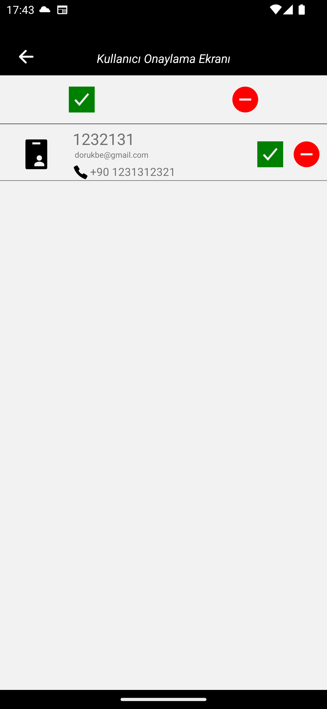

# X-TRAP Ecommerce App
<h1 align="center">
 
  
 
 
X-Trap Store E-commerce
</h1>

  

## What is X-trap Store?

X-Trap Store is a cutting-edge e-commerce platform, meticulously designed to provide users with a seamless shopping experience. Our application empowers users to explore a vast array of products curated by our admin, allowing them to effortlessly add items to their cart and even engage directly with sellers through WhatsApp.

One of the standout features of our application is the powerful 'Admin Panel,' giving complete control to the administrator. This tool enables the admin to efficiently manage the application, upload new products, and ensure a smooth and enjoyable experience for all users.

We're thrilled to announce that X-Trap Store is currently available on both Apple Store and Google Play, making it easily accessible to a wide audience.

## Apple and Google Play 

-[**Apple Store**](https://apps.apple.com/tr/app/x-trap-store/id6471013547)

-[**Google Play Store**](https://play.google.com/store/apps/details?id=com.xtrapp)

## Dependencies

- ⚛️ **React Native**: A JavaScript library that provides a way to create native mobile apps for Android and iOS.

- 🔥 **Firebase**: A cloud service that offers a framework and platform for universal React applications.

- 🟢 **Node.js**: A fast and lightweight server-side JavaScript runtime used for building web applications.

- 🤖 **Android SDK**: A software development kit used for developing Android mobile applications.

- 👁 **WatchMan**: An efficient service used to monitor file changes.

- 🧁 **CocoaPods**: A dependency manager and build system used for developing iOS applications.
## Getting started

1. Clone this repo using `git clone https://github.com/omerkocer/xtrapp`
2. Move yourself to the appropriate directory: `cd xtrapp` 
3. Plese use a new firebase config in app.js and src/config/fBaseConfig.js.
4. Run `npm install` to install dependencies 

### Getting started with the json server with relationship

1. Open new terminal
2. Run: `npm start`

### Getting started with the mobile app

1. Run `react-native run-android` 

Note: If you choose to start the mobile app in the android.

2. Run `react-native run-ios`

## License

This project is licensed under the MIT License - see the [LICENSE](https://opensource.org/licenses/MIT) page for details.

## Author

- [**Doruk Dinçol**](https://github.com/dincoldoruk)
- [**Ömer Koçer**](https://github.com/omerkocer)
